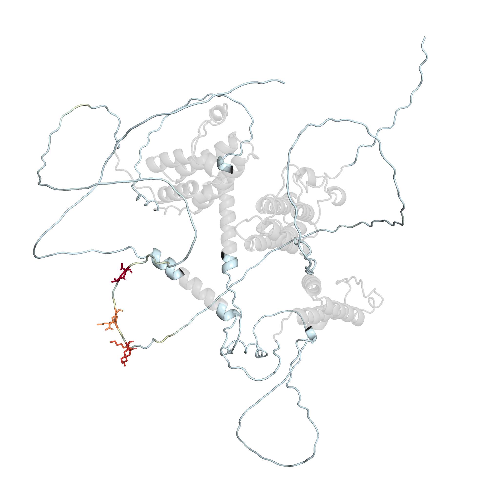
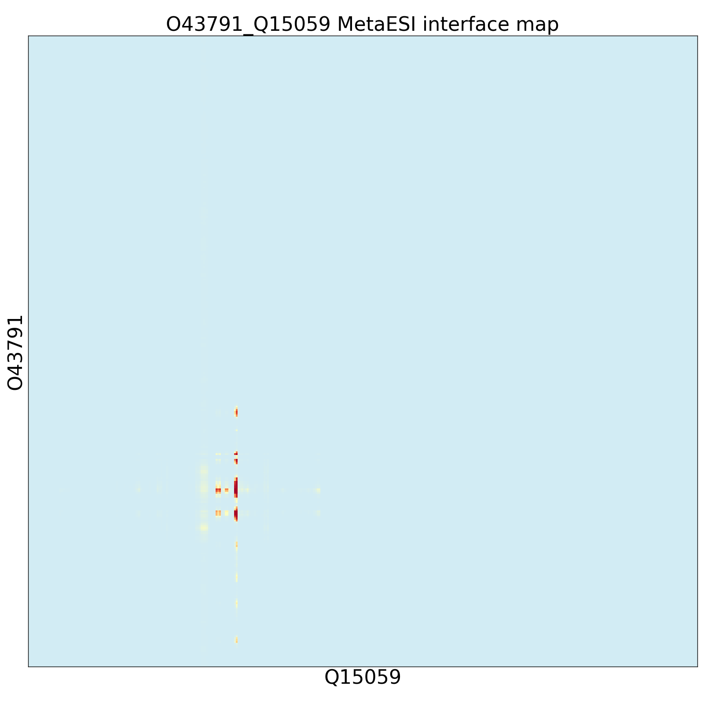

<h1 align="center">MetaESI</h1>


<!-- TABLE OF CONTENTS -->
<details open="open">
  <summary><h2 style="display: inline-block">Table of Contents</h2></summary>
  <ol>
    <li>
      <a href="#about-the-project">About The Project</a>
    </li>
    <li>
      <a href="#installation">Installation</a>
      <ul>
        <li><a href="#dependencies">Dependencies</a></li>
        <li><a href="#installation-steps">Installation Steps</a></li>
      </ul>
    </li>
    <li>
      <a href="#usage">Usage</a>
      <ul>
        <li><a href="#predicting-esi-interactions--interfaces">Predicting ESI Interactions & Interfaces</a></li>
        <li><a href="#example-spop-brd3-interaction">Example: SPOP-BRD3 Interaction</a></li>
      </ul>
    </li>
    <li>
      <a href="#visualization">Visualization</a>
      <ul>
        <li><a href="#pymol-interface-visualization">PyMOL Interface Visualization</a></li>
        <li><a href="#interface-map-interpretation">Interface Map Interpretation</a></li>
      </ul>
    </li>
    <li>
      <a href="#reproducibility">Reproducibility</a>
    </li>
    <li>
      <a href="#available-data">Available Data</a>
      <ul>
        <li><a href="#gold-standard-dataset-gsd">Gold Standard Dataset (GSD)</a></li>
        <li><a href="#predicted-e3-substrate-interactome-metaesi-atlas">Predicted E3-Substrate Interactome (MetaESI-Atlas)</a></li>
      </ul>
    </li>
    <li>
      <a href="#Contact">Contact</a>
    </li>
  </ol>
</details>


## About The Project
[](https://zenodo.org/records/16730430)
[](https://opensource.org/licenses/Apache-2.0)


<p align="center">
  
  <br>
  <b>Figure</b>: MetaESI Overall Architecture
</p>

**MetaESI** is a knowledge-guided interpretable deep learning framework that learns E3-substrate interactions while performing _de novo_ residue-level inference of their binding interfaces. We implemented a two-stage learning strategy for proteome-wide predictions: a meta-learning phase extracts transferable knowledge across multiple tasks, followed by an E3-specific transfer phase that adapts this knowledge to predict interactions for individual E3s. This enabled comprehensive mapping of the E3-substrate interactome with residue-level interface annotations across humans and seven key model organisms, generating the **MetaESI-Atlas**.

#### Key Features
- **ESI Probability Prediction**: Predicts interaction likelihood for any E3-substrate pair
- **Residue-Level Interface Inference**: Identifies binding interfaces _de novo_
- **Research-Ready Visualizations**: Generates [interface maps](https://github.com/LiDlab/MetaESI/tree/main#interface-map-interpretation) and [annotated PDB structures](https://github.com/LiDlab/MetaESI/tree/main#pymol-interface-visualization)
- **Rapid Execution**: Installs in <30 minutes; predictions in <2 minutes (GPU)
- **Cross-Platform Support**: GPU acceleration or CPU-only operation


## Installation

### Dependencies
- **Python**: 3.8
- **Key Packages**: 
  [PyTorch](https://pytorch.org/) | 
  [PyG](https://pytorch-geometric.readthedocs.io/) | 
  [Biopython](https://biopython.org/)
- **OS**: Linux (tested on Ubuntu 18.04/22.04)
- **Hardware**: NVIDIA GPU recommended (CUDA support). CPU-only mode supported but slower.

Check [environments.yml](https://github.com/LiDlab/MetaESI/blob/main/environment.yml) for list of needed packages. 
The specific dependencies can be easily installed using [Anaconda](https://www.anaconda.com/).

### Installation Steps

1. Clone repository and `cd` into it:
   ```sh
   git clone https://github.com/LiDlab/MetaESI.git
   cd MetaESI
   ```
2. Create conda environment:
   ```sh
   conda env create -f environment.yml
   conda activate MetaESI
   ```
   Alternative manual installation (recommended):
   ```sh
   conda create -n MetaESI python==3.8
   conda activate MetaESI
   conda install pyg==2.5.2 -c pyg
   conda install pytorch pytorch-cuda=11.8 -c pytorch -c nvidia
   pip install learn2learn==0.2.0
   conda install pandas==1.5.3
   conda install h5py==3.11.0
   conda install biopython==1.78
   conda install matplotlib==3.7.1
   conda install seaborn==0.13.2
   ```

## Usage

### Predicting ESI Interactions & Interfaces
Predict E3-substrate interactions and identify interface residues:
```sh
python scripts/run_MetaESI.py \
  -e <E3_UniProtID> \
  -s <Substrate_UniProtID> \
  -o <output_directory>
```

#### Example: [SPOP-BRD3](https://www.sciencedirect.com/science/article/abs/pii/S002228361930213X) Interaction

```sh
python scripts/run_MetaESI.py -e O43791 -s Q15059 -o results/test/
```

Your terminal will display:

```txt
==================================================
         MetaESI Prediction Pipeline
==================================================

[1/4] Downloading Protein Structures
--------------------------------------------------
✓ Downloaded E3 Structure (O43791)
  • PDB: results/test/AF-O43791-F1-model_v4.pdb
  • PAE: results/test/AF-O43791-F1-predicted_aligned_error_v4.json
✓ Downloaded Substrate Structure (Q15059)
  • PDB: results/test/AF-Q15059-F1-model_v4.pdb
  • PAE: results/test/AF-Q15059-F1-predicted_aligned_error_v4.json

[2/4] Processing Protein Sequence
--------------------------------------------------
✓ Generated FASTA file: O43791_Q15059.fasta
  • E3 (O43791): 374 residues
  • Substrate (Q15059): 726 residues

[3/4] Extracting Protein Features
--------------------------------------------------
Transferred model to GPU
Read /home/huawei/lidianke/connect/MetaESI-up/results/test/O43791_Q15059.fasta with 2 sequences
Processing 1 of 1 batches (2 sequences)
✓ Extracted ESM-2 features
✓ Extracted GARD features
✓ Extracted MetaESI features

[4/4] Running Prediction Model
--------------------------------------------------
✓ Loaded E3-specific model for O43791
✓ Calculated O43791-Q15059 MetaESI interface map
✓ Calculated O43791-Q15059 MetaESI score


==================================================
               PREDICTION RESULTS
==================================================
🔬 MetaESI Score
  • 0.985 (very high confidence)

🔥 Interface Residues
  • E3 (O43791): F102-S105; K115-R121; F133-F136
  • Substrate (Q15059): T248-T249

📁 Output Files Generated
  • Full interface map: O43791_Q15059_imap.pdf
  • Interface hotspot: O43791_Q15059_hotspot.pdf
  • Annotated PDBs: O43791_MetaESI_colored.pdb, Q15059_MetaESI_colored.pdb

==================================================
      Prediction completed successfully!
==================================================
```

#### Output Files

| File Type |                     Example Files                      | Description |
|:-------|:------------------------------------------------------:|:------|
| `Annotated PDBs` | `O43791_MetaESI_colored.pdb`<br/>`Q15059_MetaESI_colored.pdb` | PDB files with interface scores stored in B-factor column |
| `Interface Map` |`O43791_Q15059_imap.pdf`| Full-length interaction probability landscape |
| `Interface Hotspot` |`O43791_Q15059_hotspot.pdf`| Zoomed view of high-probability interaction regions |


## Visualization

### PyMOL Interface Visualization

Visualize interface predictions on the protein structure:

1. Open annotated PDB in [PyMOL](https://pymol.org/):

```pymol
load O43791_MetaESI_colored.pdb
# OR
load Q15059_MetaESI_colored.pdb
```

2. Apply the MetaESI interface gradient coloring:

```pymol
bg_color white
set_color color1, [210, 236, 244]
set_color color2, [254, 254, 190]
set_color color3, [254, 210, 131]
set_color color4, [248, 140, 81]
set_color color5, [221, 62, 45]
set_color color6, [165, 0, 38]
spectrum b, color1 color2 color3 color4 color5 color6, all, minimum=0, maximum=1
set_color my_gray, [137, 137, 137]
select gray_residues, b < 0
color my_gray, gray_residues
set cartoon_transparency, 0.7, gray_residues
set transparency, 0.7, gray_residues
```

Color Guide:

* <span style="color:red">Red</span> regions indicate high-probability interface residues
* <span style="color:lightblue">Light blue</span> regions indicate low-probability interface residues
* <span style="color:grey">Gray</span> regions indicate non-interface residues with transparency


<p align="center">   <br>O43791_MetaESI_colored.pdb   |   Q15059_MetaESI_colored.pdb</p>


### Interface Map Interpretation

Left: Full Interface Map (Residue-residue interaction probability matrix)
Right: Zoomed Interface Hotspot (Zoomed 21×21 region centered at maximum probability):

<p align="center">   <br>O43791_Q15059_imap.pdf   |   O43791_Q15059_hotspot.pdf</p>


**📒 Note:** You may directly include these visualizations in research publications.

#### Color Reference:
<p align="center">
  <a href="https://github.com/LiDlab/MetaESI/raw/main/results/test/bar.pdf" download>
    
  </a>
  <br>
  (Click to download reference scale for publications)
</p>


#### Runtime Information
GPU execution (recommended): ~110 seconds per pair

CPU execution: Add `--gpu -1` to command (may take 2-4 minutes per pair)


## Reproducibility

### Data Setup
1. Install aria2:
    ```sh
    sudo apt install aria2
    ```

2. Download datasets:
    ```sh
    aria2c "https://zenodo.org/records/16730897/files/data.tar.gz?download=1"
    tar -xzvf data.tar.gz
    ```

3. Download all E3-specific models (~2 GB):
    ```sh
    aria2c "https://zenodo.org/records/16730897/files/e3_specific_model.zip?download=1"
    unzip -o e3_specific_model.zip -d models/e3_specific_model/
    ```

4. Download databases (~85 GB):
    ```sh
    scripts/download_all_data.sh data/human/ > download_all.log &
    ```
    Note: For incomplete PAE downloads, run:
    ```sh
    scripts/download_alphafold_pae.sh data/human/
    ```


### Feature Generation
 ```sh
# Generate GARD features
python gard/preprocessing/preprocessing_features.py

# Generate MetaESI features
python metaesi/preprocessing/preprocessing_features.py
 ```

### Repository Structure
 
| Directory |                        Purpose                        |
|:-------|:-----------------------------------------------------:|
| `./evaluation` |                 Benchmarking scripts                  |
| `./gard` | 	Graph Aware Residue Depth (GARD) feature processing  |
| `./metaesi` |              	Data preprocessing and model architecture              |
| `./models` |               Pretrained model parameters                |
| `./results` |              Benchmark and test case outputs              |
| `./scripts` |               Execution scripts                |


## Available Data

* #### [Gold Standard Dataset (GSD)](https://zenodo.org/records/16730585/files/Supplementary%20Data%203.xlsx?download=1)
MetaESI has established a rigorous gold standard dataset where the positive set is sourced from [UBibroswer 2.0](http://ubibrowser.bio-it.cn/ubibrowser_v3/) and negative set is derived from [STRING](https://www.string-db.org/).

We also provide **Gold Standard Positive (GSP) dataset with predicted interface residues**, please [click](https://zenodo.org/records/16730585/files/Supplementary%20Data%204.xlsx?download=1) to download.

* #### [Predicted E3-Substrate Interactome (MetaESI-Atlas)](https://zenodo.org/records/16730585/files/Supplementary%20Data%201.xlsx?download=1)
MetaESI was used to performed a proteome-wide scan to construct the [MetaESI-Atlas]((https://zenodo.org/records/16730585/files/Supplementary%20Data%201.xlsx?download=1)), comprising 68,056 predicted interactions and binding interfaces between 675 E3s and 18,752 substrates across 8 species.


## Contact
Dianke Li: diankeli@foxmail.com

Yuan Liu: liuy1219@foxmail.com

Dong Li: lidong.bprc@foxmail.com
