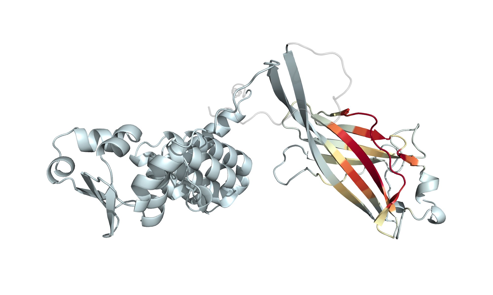
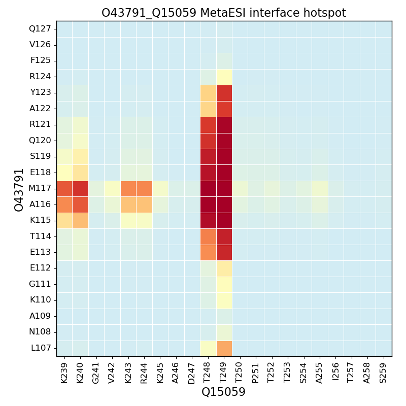

<h1 align="center">MetaESI</h1>


<!-- TABLE OF CONTENTS -->
<details open="open">
  <summary><h2 style="display: inline-block">Table of Contents</h2></summary>
  <ol>
    <li>
      <a href="#about-the-project">About The Project</a>
    </li>
    <li>
      <a href="#getting-started">Getting Started</a>
      <ul>
        <li><a href="#dependencies">Dependencies</a></li>
        <li><a href="#installation">Installation</a></li>
        <li><a href="#folders">Folders</a></li>
      </ul>
    </li>
    <li>
      <a href="#usage">Usage</a>
      <ul>
        <li><a href="#dsi-prediction">DSI prediction</a></li>
        <li><a href="#dsi-binding-site-inference">DSI key sequence feature inference</a></li>
      </ul>
    </li>
    <li>
      <a href="#available-data">Available Data</a>
      <ul>
        <li><a href="#gold-standard-dataset-gsd">Gold Standard Dataset (GSD)</a></li>
        <li><a href="#benchmark-dataset">Benchmark Dataset</a></li>
        <li><a href="#predicted-E3-substrate-interaction-dataset-pdsid">Predicted E3-Substrate Interaction Dataset (PDSID)</a></li>
      </ul>
    </li>
    <li>
      <a href="#License">License</a>
    </li>
    <li>
      <a href="#Contact">Contact</a>
    </li>
  </ol>
</details>


## About The Project
[](https://github.com/Dianke-Li/MetaESI/releases)
[](https://zenodo.org/records/10866136)
[](https://opensource.org/licenses/Apache-2.0)

<p align="center">
  
  <br>
  <b>Figure</b>: MetaESI Overall Architecture
</p>

**MetaESI** is a knowledge-guided interpretable deep learning framework that learns E3-substrate interactions while performing _de novo_ residue-level inference of their binding interfaces. We implemented a two-stage learning strategy for proteome-wide predictions: a meta-learning phase extracts transferable knowledge across multiple tasks, followed by an E3-specific transfer phase that adapts this knowledge to predict interactions for individual E3s. This enabled comprehensive mapping of the E3-substrate interactome with residue-level interface annotations across humans and seven key model organisms, generating the **MetaESI-Atlas**.

#### Key Features
* ESI Probability Prediction: For any E3-substrate pair
* Residue-Level Interface Inference: _De novo_ interface identification
* Research-Ready Visualizations: Direct output of interface maps and annotated PDBs
* Rapid Setup & Execution: Install in <30 min, predict in <2 min (GPU)
* Cross-Platform: GPU acceleration or CPU-only mode

## Installation

### Dependencies
- Python: 3.8
- Key Packages: [PyTorch](https://pytorch.org/), [PyG](https://pytorch-geometric.readthedocs.io/), [Biopython](https://biopython.org/)
- OS: Linux (tested on Ubuntu 18.04/22.04)
- Hardware: NVIDIA GPU recommended (CUDA support). CPU-only mode supported but slower.

Check [environments.yml](https://github.com/LiDlab/MetaESI/blob/main/environment.yml) for list of needed packages. 
The specific dependencies can be easily installed using [Anaconda](https://www.anaconda.com/).

### Installation

1. Clone repository and `cd` into it:
   ```sh
   git clone https://github.com/LiDlab/MetaESI.git
   cd MetaESI
   ```
2. Create conda environment:
   ```sh
   conda env create -f environment.yml
   conda activate MetaESI
   ```
   Or install manually the dependencies:
   ```sh
   conda create -n MetaESI python==3.8
   conda activate MetaESI
   conda install pyg==2.5.2 -c pyg
   conda install pytorch pytorch-cuda=11.8 -c pytorch -c nvidia
   pip install learn2learn==0.2.0
   conda install pandas==1.5.3
   conda install h5py==3.11.0
   conda install biopython==1.78
   conda install matplotlib==3.7.1
   conda install seaborn==0.13.2
   ```

## Usage

### ESI Prediction & Interface Inference
Predict E3-substrate interactions and identify interface residues:
```sh
python scripts/run_MetaESI.py \
  -e <E3_UniProtID> \
  -s <Substrate_UniProtID> \
  -o <output_directory>
```

#### Example: [SPOP-BRD3](https://www.sciencedirect.com/science/article/abs/pii/S002228361930213X) Interaction

```sh
python scripts/run_MetaESI.py -e O43791 -s Q15059 -o results/test/
```

Your terminal will display:

```txt
==================================================
         MetaESI Prediction Pipeline
==================================================

[1/4] Downloading Protein Structures
--------------------------------------------------
✓ Downloaded E3 Structure (O43791)
  • PDB: results/test/AF-O43791-F1-model_v4.pdb
  • PAE: results/test/AF-O43791-F1-predicted_aligned_error_v4.json
✓ Downloaded Substrate Structure (Q15059)
  • PDB: results/test/AF-Q15059-F1-model_v4.pdb
  • PAE: results/test/AF-Q15059-F1-predicted_aligned_error_v4.json

[2/4] Processing Protein Sequence
--------------------------------------------------
✓ Generated FASTA file: O43791_Q15059.fasta
  • E3 (O43791): 374 residues
  • Substrate (Q15059): 726 residues

[3/4] Extracting Protein Features
--------------------------------------------------
Transferred model to GPU
Read /home/huawei/lidianke/connect/MetaESI-up/results/test/O43791_Q15059.fasta with 2 sequences
Processing 1 of 1 batches (2 sequences)
✓ Extracted ESM-2 features
✓ Extracted GARD features
✓ Extracted MetaESI features

[4/4] Running Prediction Model
--------------------------------------------------
✓ Loaded E3-specific model for O43791
✓ Calculated O43791-Q15059 MetaESI interface map
✓ Calculated O43791-Q15059 MetaESI score


==================================================
               PREDICTION RESULTS
==================================================
🔬 MetaESI Score
  • 0.985 (very high confidence)

🔥 Interface Residues
  • E3 (O43791): F102-S105; K115-R121; F133-F136
  • Substrate (Q15059): T248-T249

📁 Output Files Generated
  • Full interface map: O43791_Q15059_imap.pdf
  • Interface hotspot: O43791_Q15059_hotspot.pdf
  • Annotated PDBs: O43791_MetaESI_colored.pdb, Q15059_MetaESI_colored.pdb

==================================================
      Prediction completed successfully!
==================================================
```

#### Output Overview
After successful execution, you'll find these outputs in results/test/:

| File Type |                     Example Files                      | Description |
|:-------|:------------------------------------------------------:|:------|
| `Annotated PDBs` | `O43791_MetaESI_colored.pdb`<br/>`Q15059_MetaESI_colored.pdb` | PDB files with interface scores stored in B-factor column |
| `Interface Map` |`O43791_Q15059_imap.pdf`| Full-length interaction probability landscape |
| `Interface Hotspot` |`O43791_Q15059_hotspot.pdf`| Zoomed view of high-probability interaction regions |

### Visualizing Results

#### PyMOL Interface Visualization

Visualize interface predictions on the protein structure:

1. Open annotated PDB in [PyMOL](https://pymol.org/):

```pymol
load O43791_MetaESI_colored.pdb
```

2. Apply the MetaESI interface gradient coloring:

```pymol
bg_color white
set_color color1, [210, 236, 244]
set_color color2, [254, 254, 190]
set_color color3, [254, 210, 131]
set_color color4, [248, 140, 81]
set_color color5, [221, 62, 45]
set_color color6, [165, 0, 38]
spectrum b, color1 color2 color3 color4 color5 color6, all, minimum=0, maximum=1
set_color my_gray, [137, 137, 137]
select gray_residues, b < 0
color my_gray, gray_residues
set cartoon_transparency, 0.7, gray_residues
set transparency, 0.7, gray_residues
```

This will create a gradient visualization where:

* Red regions indicate high-probability interface residues
* Blue regions indicate low-probability interface residues
* Gray regions indicate non-interface residues with transparency

<p align="center">
  
  <br>
  O43791_MetaESI_colored.pdb
</p>


#### Interface Map Interpretation

Full Interface Map (Residue-residue interaction probability matrix)


<p align="center">
  
  <br>
  O43791_Q15059_imap.pdf
</p>

Zoomed Interface Hotspot (Zoomed 21×21 region centered at maximum probability):

<p align="center">
  
  <br>
  O43791_Q15059_hotspot.pdf
</p>

**📒 Note:** You may directly include these visualizations in research publications. Download the reference color bar for proper heatmap interpretation:
<p align="center">
  <a href="results/test/bar.png" download>
    
  </a>
  <br>
  <b>Color Scale Reference</b> (click image to download)
</p>


#### Runtime Information
GPU execution (recommended): ~110 seconds per pair

CPU execution: Add `--gpu -1` to command (may take 2-4 minutes per pair)


### Reproducibility


1. Download all data:

    * Install `aria2c`. On Debian-based distributions this can be installed by running:
    ```sh
    sudo apt install aria2
   ```

    * Please use the script `scripts/download_all_data.sh` to download and set
        up all databases. This may take substantial time (download size is ~85
        GB), so we recommend running this script in the background:

    ```bash
    scripts/download_all_data.sh data/human/ > download_all.log &
    ```


If you want to replicate the five-fold cross-validation and independent testing process of MetaESI, please run the `main.py` script in the src folder.
```sh
cd src/
```
AND
```sh
python main_GSD.py && python main_GSD_MetaESI_variant.py && python main_GSD_ML.py
```

### Folders
./src contains the implementation for the fivefold cross-validations and independent tests of MetaESI and Baselines.

./preprocessing contains the selection of gold standard dataset and the coding of protein sequence features and similarity matrix.

./explain contains the invoking of PairExplainer, which is used to analyze the explainability of the queried ESI.

./results contains MetaESI prediction results, explainable analysis results, and trained MetaESI model.

└──111


## Available Data

* #### [Gold Standard Dataset (GSD)](https://github.com/LiDlab/MetaESI/raw/master/Supplementary%20Tables/Supplementary%20Table%201.xlsx)
MetaESI has established a rigorous gold standard dataset where the positive set is sourced from [UBibroswer 2.0](http://ubibrowser.bio-it.cn/ubibrowser_v3/) and negative set is derived from [BioGRID](https://thebiogrid.org/). We divided GSD into the cross-validation dataset and the independent test dataset in chronological order.

We also provide **Gold Standard Positive Set (GSP) with inferred binding sites**, please [click](https://github.com/LiDlab/MetaESI/raw/master/Supplementary%20Tables/Supplementary%20Table%206.xlsx) to download.

* #### [Benchmark Dataset](https://github.com/LiDlab/MetaESI/tree/master/results/performance/GSD)

To ensure fair comparison, cross-validation dataset and independent test dataset are intersected with the corresponding datasets from [UbiBrowser 2.0](http://ubibrowser.bio-it.cn/ubibrowser_v3/home/download).

Click to download the [cross-validation results](https://github.com/LiDlab/MetaESI/blob/master/results/performance/GSD/GSD_crossval_prob.csv) and the [independent test results](https://github.com/LiDlab/MetaESI/blob/master/results/performance/GSD/GSD_indtest_prob.csv).

* #### [Predicted E3-Substrate Interaction Dataset (PESID)](https://github.com/LiDlab/MetaESI/raw/master/Supplementary%20Tables/Supplementary%20Table%204.xlsx)
MetaESI was used to performed a large-scale proteome-wide ESI scanning, resulting in a predicted E3-substrate interaction dataset (PESID) with 19,461 predicted interactions between 85 E3s and 5,151 substrates.

We also provide **PESID with inferred binding sites**, please [click](https://github.com/LiDlab/MetaESI/raw/master/Supplementary%20Tables/Supplementary%20Table%204.xlsx) to download.

## License

This project is covered under the **Apache 2.0 License**.

## Contact
Dianke Li: diankeli@foxmail.com

Yuan Liu: liuy1219@foxmail.com

Dong Li: lidong.bprc@foxmail.com
